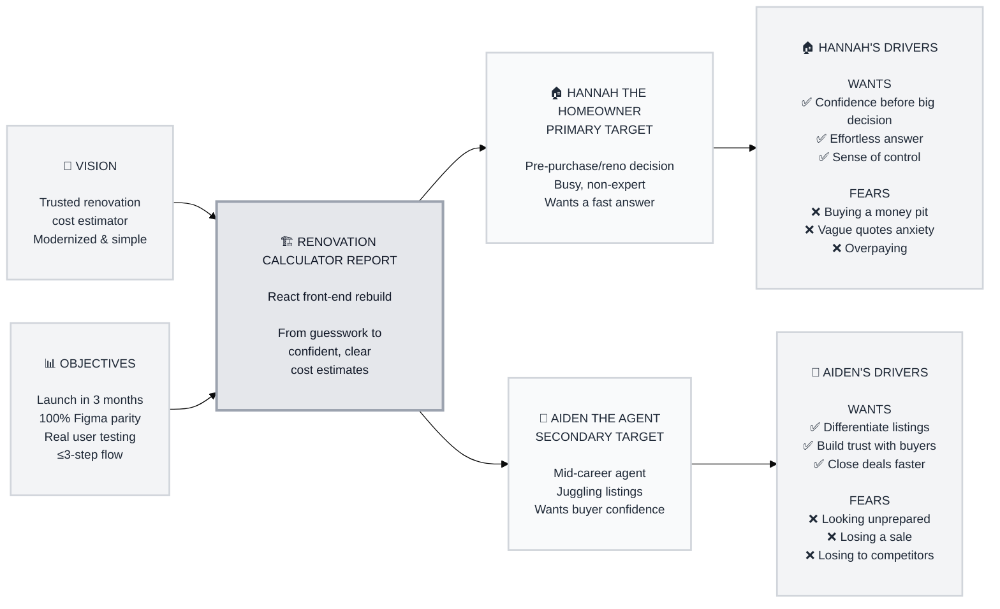

# Trigger Map Poster: spike_cityscope_bmad_wds_figma2epic

> Visual overview connecting business goals to user psychology

**Created:** 2026-08-12
**Author:** Igrant
**Methodology:** Based on Effect Mapping (Balic & Domingues), adapted for WDS framework

---

## Strategic Documents

This is the visual overview. For detailed documentation, see:

- **personas/hannah-the-homeowner.md** - Full persona detail
- **personas/aiden-the-agent.md** - Full persona detail

---

## Vision

Be the go-to renovation cost estimator that homeowners and agents trust before making a buy/sell decision — modernized, fast, and dead simple to use.

---

## Business Objectives

### Objective 1: Launch the rebuilt React front-end (address entry → questionnaire → estimate)

- **Metric:** Full flow implemented and deployed
- **Target:** Live, functional front-end
- **Timeline:** Within 3 months

### Objective 2: Achieve 100% visual/UX parity with the existing Figma design

- **Metric:** % of core flow screens matching Figma spec (layout, typography, spacing, color)
- **Target:** 100% of core flow screens
- **Timeline:** By launch

### Objective 3: Run real user testing with homeowners and real estate agents

- **Metric:** Completed usability sessions with real target users (not internal-only)
- **Target:** Validated flow feedback collected
- **Timeline:** Within the 3-month window

### Objective 4: Keep the estimate journey to 3 simple steps or fewer

- **Metric:** Number of steps in the renovation questionnaire flow
- **Target:** ≤ 3 steps (matching current Figma structure: renovation type, what to renovate, more questions)
- **Timeline:** By launch

---

## Target Groups (Prioritized)

### 1. Hannah the Homeowner

**Priority Reasoning:** Hannah is the primary end-user directly experiencing the flow. Nailing her experience is the foundation the whole product depends on — and indirectly benefits Aiden's use case too.

> Hannah is in her mid-30s to 50s, either living in a property she's considering renovating or eyeing a new home before purchase. Not a design or construction expert, she wants a realistic "what would this cost me?" answer before getting emotionally attached to a listing or committing to a reno project. She's busy — browsing listings in spare moments on her phone or laptop — and frustrated by vague contractor quotes, slow response times, and the anxiety of not knowing if a fixer-upper is a smart buy or a money pit.

**Key Positive Drivers:**
- Feel confident and informed before making a big financial decision
- Get a quick, effortless answer without hassling contractors
- Feel a sense of control over the buying/renovating process

**Key Negative Drivers:**
- Fear of buying a "money pit" — a house with hidden renovation costs
- Anxiety from vague or inconsistent contractor quotes
- Fear of overpaying or being taken advantage of during renovation

### 2. Aiden the Agent

**Priority Reasoning:** Secondary target — his needs are served as a byproduct of a strong Hannah-focused experience, but still matter for adoption and business value.

> Aiden is a real estate agent, mid-career, juggling multiple listings and client relationships. He wants his listings to stand out and give buyers extra confidence to move forward, especially for properties that could use updating. He's frustrated when buyers hesitate or walk away because they can't picture the cost/value of renovating — a stalled deal costs him time and commission.

**Key Positive Drivers:**
- Differentiate his listings from competing agents
- Build trust with buyers through credible, third-party-feeling data
- Close deals faster by removing buyer hesitation

**Key Negative Drivers:**
- Looking unprepared or unable to answer buyer questions
- Losing a sale because a buyer couldn't picture renovation cost/value
- Losing buyers to a competitor's better-supported listing

---

## Trigger Map Visualization

---

## Design Focus Statement

Design primarily for **Hannah the Homeowner**. Every screen — address entry, questionnaire, and estimate display — should prioritize clarity, transparency, and trust so Hannah feels confident and safe from being misled or overcharged. Aiden's needs (differentiation, trust, professionalism) are served as a byproduct of a strong Hannah-focused experience and receive secondary attention.

**Primary Design Target:** Hannah the Homeowner

**Must Address:**
- Confidence before a big decision
- Vague quotes anxiety
- Overpaying fear

**Should Address:**
- Build trust (Aiden)
- Differentiate listings (Aiden)

---

## Cross-Group Patterns

### Shared Drivers

Both Hannah and Aiden want to remove uncertainty around renovation cost — Hannah for a personal financial decision, Aiden for sales enablement. Trust and credibility of the estimate matter to both.

### Unique Drivers

- **Unique to Hannah:** Emotional/financial risk aversion — fear of a "money pit."
- **Unique to Aiden:** Professional credibility and competitive differentiation among agents.

### Potential Tensions

Aiden wants the report to feel authoritative and persuasive (to help close deals), while Hannah wants it to feel neutral and trustworthy, not sales-y. The design must strike a balance — presenting the estimate factually and transparently so it works for both audiences without feeling like a sales pitch.

---

## Next Steps

This Trigger Map Poster provides a quick reference. For detailed work:

- [ ] **Review detailed docs** - See persona documents in `personas/`
- [ ] **Guide UX Design** - Ensure designs address priority drivers (Phase 3: UX Scenarios)
- [ ] **Validate with Users** - Test assumptions with real Hannah/Aiden-type users during the 3-month window
- [ ] **Update as Learnings Emerge** - This is a living document

---

_Generated with Whiteport Design Studio framework_
_Trigger Mapping methodology credits: Effect Mapping by Mijo Balic & Ingrid Domingues (inUse), adapted with negative driving forces_
