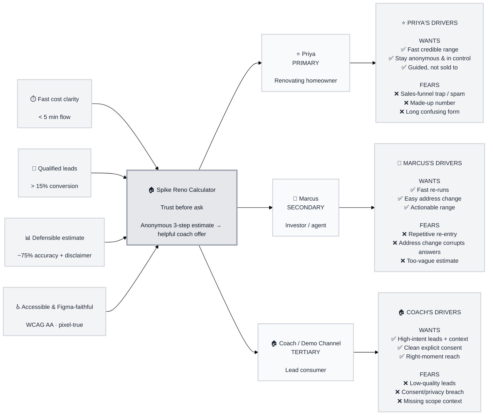

# Trigger Map Poster: Spike Reno Calculator

> Visual overview connecting business goals to user psychology

**Created:** 2026-08-13
**Author:** Igrant (facilitated by Saga, WDS Strategic Analyst)
**Methodology:** Based on Effect Mapping (Balic & Domingues), adapted for WDS (negative driving forces)
**Branch:** ig-figma-to-bmad-ux

> ⚠️ **Provenance note:** Derived via **documentation synthesis** from existing authoritative
> artifacts (`product-brief.md`, `prd.md`, UX `EXPERIENCE.md`) plus the live Figma (node `9:90`).
> Owner unavailable at authoring — every element is source-cited and **pending owner confirmation
> and user validation** before it drives Phase 3.

---

## Strategic Documents

- **personas/** — full persona detail files (Priya, Marcus, the Home Loan Coach)
- **feature-impact-analysis.md** — prioritized features with impact scores

---

## Vision

Give Australian homeowners a fast, low-friction, trustworthy way to understand what a renovation
could cost — in under five minutes, with no account and no obligation — and turn that moment of
clarity into a genuinely helpful conversation about financing. For **Demo Channel**, become the
lightweight digital touchpoint that captures high-intent renovation prospects and routes them to a
Home Loan Coach. *(Source: `product-brief.md §1,§4`; `EXPERIENCE.md § Foundation`.)*

---

## Business Objectives

### Objective 1: Fast, credible cost clarity
- **Metric:** Time to complete the estimate flow
- **Target:** < 5 minutes average (G1)
- **Timeline:** MVP

### Objective 2: Qualified home-loan leads
- **Metric:** Lead conversion rate (finishers → lead submissions)
- **Target:** > 15% of finishers (G2)
- **Timeline:** MVP + measurement window

### Objective 3: Defensible estimate
- **Metric:** Estimate accuracy vs real quotes; confidence + disclaimer present on every number
- **Target:** within ~75% of actual quotes (G3)
- **Timeline:** MVP (algorithm is `[OPEN]` R3)

### Objective 4: Accessible, on-brand, Figma-faithful experience
- **Metric:** WCAG 2.1 AA conformance; visual diff of running app vs Figma design
- **Target:** AA pass; no unexplained pixel drift from node `9:90` (G4 + this run's fidelity goal)
- **Timeline:** MVP

*(Sources: `product-brief.md §2,§6`; `fidelity-findings.md`.)*

---

## Target Groups (Prioritized)

### 1. Priya — the Renovating Homeowner  ⭐ PRIMARY
**Priority Reasoning:** She is the flow's reason to exist and the source of every lead. If the
experience doesn't earn her trust fast, no business objective is met. *(product-brief.md §3.)*

> Owns/occupies an Australian home, planning a specific renovation, basic-to-moderate digital
> literacy, wants a ballpark cost fast without handing over personal details upfront.

**Key Positive Drivers:**
- Get a credible cost range fast, with almost no effort
- Stay anonymous and in control until *she* decides to engage
- Feel guided and reassured, not sold to

**Key Negative Drivers:**
- Fear of being trapped into a sales funnel / spammed
- Fear the number is made-up or misleading
- Fear the form is long, confusing, or demands too much

### 2. Marcus — the Property Investor / Agent  💼 SECONDARY
**Priority Reasoning:** Higher-frequency power user who values speed and re-running estimates
across properties; validates that the flow works for repeat, address-swapping use. *(product-brief.md §3.)*

> Evaluates renovation potential across multiple properties; wants speed and easy address change.

**Key Positive Drivers:**
- Re-run estimates quickly across many addresses
- Change the property address without losing his place
- Trust the range enough to use it in decisions

**Key Negative Drivers:**
- Fear of slow, repetitive re-entry
- Fear that changing address silently corrupts prior answers
- Fear of an estimate too vague to act on

### 3. The Home Loan Coach / Demo Channel  🏠 TERTIARY (stakeholder)
**Priority Reasoning:** Consumes the leads; the design must hand over enough context (estimate,
scope, contact + explicit consent) to convert. *(product-brief.md §3.)*

> Needs qualified, well-contextualised leads with consent to follow up effectively.

**Key Positive Drivers:**
- Receive high-intent leads with scope + budget context
- Have explicit marketing consent captured cleanly
- Reach the homeowner at the right moment (right after the estimate)

**Key Negative Drivers:**
- Fear of low-quality / low-intent leads
- Fear of consent/privacy non-compliance (AU Privacy Act)
- Fear of missing context (no scope → cold, ineffective calls)

---

## Trigger Map Visualization

---

## Design Focus Statement

Design first for **Priya**: earn trust *before* asking for anything. Every screen must make the
estimate feel fast, credible, and low-pressure — the coach offer appears only after she sees a
number. The Figma design is the source of truth for how this looks; the running app must match it.

**Primary Design Target:** Priya — the Renovating Homeowner

**Must Address:**
- Show a credible range fast, with minimal input, no account (Priya wants; Coach needs the completion)
- Keep her anonymous and in control until she chooses to engage (Priya's core fear: the funnel trap)
- Frame every number with a humble range + constant disclaimer (Priya's "made-up number" fear; G3)
- Explicit, clean consent gate on lead capture (Coach's compliance need; AU Privacy Act)

**Should Address:**
- Fast re-runs and safe address change that resets dependent answers predictably (Marcus)
- Hand the Coach enough scope/budget context on each lead (Coach)
- Plain, honest, low-pressure Australian voice throughout (all groups; `EXPERIENCE.md § Voice`)

---

## Cross-Group Patterns

### Shared Drivers
- **Trust in the number** — Priya, Marcus, and the Coach all depend on the estimate feeling
  credible (range + confidence + disclaimer). This is the product's central promise.
- **Speed** — Priya and Marcus both reward a fast, low-friction flow.

### Unique Drivers
- **Priya:** anonymity and low-pressure guidance (unique emotional need).
- **Marcus:** address-swapping and repeat-use efficiency.
- **Coach:** lead context + explicit consent capture.

### Potential Tensions
- **"Trust before ask" vs "> 15% lead conversion."** Pushing the coach CTA too hard would raise
  short-term conversion but violate Priya's core fear and erode trust. Resolution: the CTA is an
  *offer after value*, never a gate. *(Source: `EXPERIENCE.md § Voice and Tone`.)*
- **Anonymity vs lead context.** The Coach wants rich context; Priya resists upfront data. Resolution:
  capture scope implicitly from the estimate; ask for contact + consent only at the offer moment.

---

## Next Steps

- [ ] **Owner confirmation + user validation** — validate these personas/drivers with real target-group members (currently synthesized from docs, not primary research).
- [ ] **Use feature-impact-analysis.md** to prioritise MVP scope.
- [ ] **Guide UX Design (Phase 3+)** — ensure Figma-grounded designs address Priya's must-address drivers.
- [ ] Resolve carried `[OPEN]` items (Step 2 list, Step 3 questions, cost algorithm, phone-CTA vs lead-form).

---

_Generated with Whiteport Design Studio framework_
_Trigger Mapping methodology credits: Effect Mapping by Mijo Balic & Ingrid Domingues (inUse), adapted with negative driving forces_
