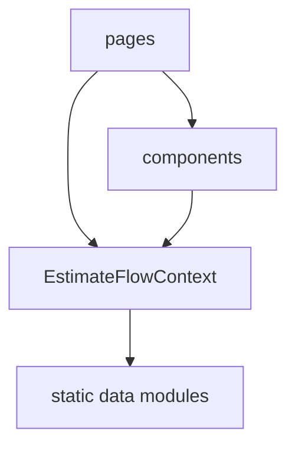

# Architecture Spine — Renovation Calculator Front-End

## Design Paradigm

Simple **layered-component** architecture: `pages/` (one per flow step) compose from `components/` (shared, reusable UI), reading/writing shared flow state from a single top-level `EstimateFlowContext`. No hexagonal/DDD layering — unwarranted for a 3-page, front-end-only, static-data spike.

## Invariants & Rules

### AD-1 — Single shared flow-state owner [ADOPTED]

- **Binds:** FR-1, FR-2, FR-4
- **Prevents:** each page independently owning/resetting its own slice of answer state, which would break "Edit Estimate retains answers" (FR-4).
- **Rule:** All questionnaire/address answers live in one `EstimateFlowContext` (React Context) mounted above the router. Pages read and write through it — never local component state for flow data. Only ephemeral UI state (e.g. "is this accordion open") may be local to a page/component.

### AD-2 — MUI as the component layer [ADOPTED]

- **Binds:** all pages
- **Prevents:** hand-rolled UI primitives diverging from Figma's already-MUI-based export (MuiGrid2, MuiAccordion, MuiFormControl class names observed in source).
- **Rule:** All UI primitives (layout grid, accordion, form controls, buttons) are built on MUI components. Custom components wrap MUI, they don't replace it.

### AD-3 — No backend/API calls

- **Binds:** all pages
- **Prevents:** a page quietly wiring up a fetch/axios call for "real" data, breaking the front-end-only constraint.
- **Rule:** Address validation and cost-estimate values are read from local static/mock data modules (e.g. `src/data/*.ts`) only. No network calls in v1.

### AD-4 — Single-select, single-open-accordion contract

- **Binds:** FR-2 (Questionnaire)
- **Prevents:** two independently-built accordion steps disagreeing on whether multiple steps can be open, or whether Step 2 allows multi-select.
- **Rule:** Only one questionnaire step is expanded at a time (auto-expand next on completion); Step 2 "what to renovate" is single-select only.

### Dependency Direction



## Consistency Conventions

| Concern | Convention |
| --- | --- |
| Naming (entities, files, interfaces, events) | PascalCase components (`AddressEntryPage.tsx`), camelCase context values, kebab-case data files |
| Data & formats | Answers stored as a flat `EstimateAnswers` object: `{ address, renovationType, whatToRenovate, sizeSqm, qualityTier }` |
| State & cross-cutting | All flow-state mutation goes through `EstimateFlowContext` setters — never prop-drilled setState across pages |

## Stack

| Name | Version |
| --- | --- |
| React | 18.x (verify exact pin at scaffold time) |
| Vite | 6.x |
| TypeScript | 5.x |
| MUI (@mui/material) | 5.x or 6.x — pin at scaffold time |
| React Router | 6.x (3-route flow: `/`, `/questionnaire`, `/estimate`) |

## Structural Seed

```text
src/
  pages/
    AddressEntryPage.tsx       # Page 1.1
    QuestionnairePage.tsx      # Page 1.2
    EstimateReportPage.tsx     # Page 1.3
  components/
    # shared MUI-wrapped components (header, footer, accordion step, etc.)
  context/
    EstimateFlowContext.tsx    # AD-1: single flow-state owner
  data/
    mockAddresses.ts
    mockEstimates.ts
  App.tsx                      # router + EstimateFlowContext provider
```

## Capability → Architecture Map

| Capability / Area | Lives in | Governed by |
| --- | --- | --- |
| FR-1 Address Entry | `pages/AddressEntryPage.tsx` | AD-1, AD-3 |
| FR-2 Questionnaire | `pages/QuestionnairePage.tsx` | AD-1, AD-2, AD-4 |
| FR-3 View estimate | `pages/EstimateReportPage.tsx` | AD-2, AD-3 |
| FR-4 Edit estimate (retain answers) | `context/EstimateFlowContext.tsx` | AD-1 |

## Deferred

- Real address lookup/geocoding API — deferred until backend phase (PRD Open Question 3).
- Real cost-calculation engine — deferred (PRD Non-Goal, Open Question 2).
- Agent-specific (Aiden) UI variant — deferred pending confirmation the journey truly differs (PRD Open Question 1).
- Testing strategy, CI/CD, deployment/hosting — not decided at this altitude; revisit if this spike graduates beyond a pipeline test.
