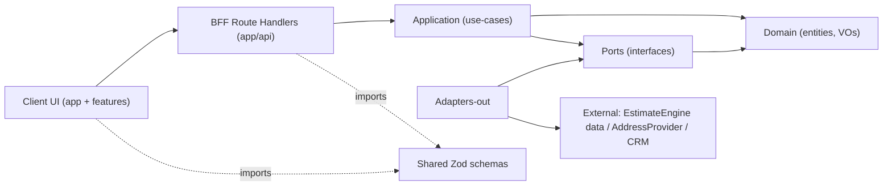
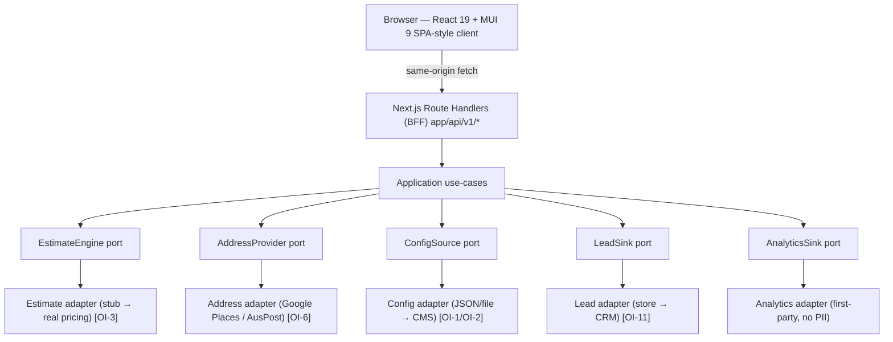
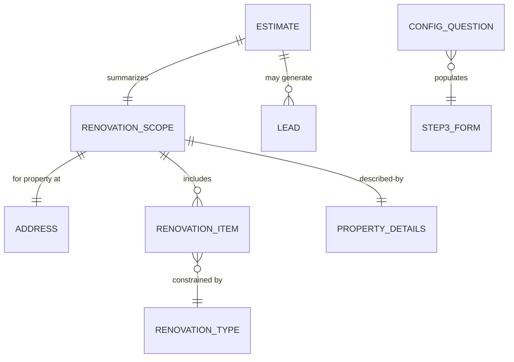

# Architecture Spine — Spike Reno Calculator

## Design Paradigm

**Ports & Adapters (Hexagonal) domain core, wrapped by a Next.js BFF, consumed by a feature-sliced layered React client.**

The product's three biggest unknowns are all *external* — the real cost algorithm (OI-3), the address provider (OI-6), and the lead/CRM sink (OI-11). Hexagonal makes each an outbound **port** with a swappable **adapter**, so the build proceeds against interfaces and the unknowns resolve without touching UI or domain. A single Next.js app hosts both the client and the BFF, giving one secure server boundary for API keys and PII.

Layer → namespace map (single Next.js app, TypeScript):

| Layer | Lives in | Depends on |
| --- | --- | --- |
| **Client (UI)** | `app/(calculator)/**`, `src/features/**`, `src/components/**` | BFF routes only (via `src/lib/api-client`) |
| **BFF (adapters-in)** | `app/api/**` Route Handlers | Application services |
| **Application** | `src/server/application/**` (use-cases) | Domain + ports |
| **Domain** | `src/server/domain/**` (entities, value objects) | nothing outward |
| **Ports** | `src/server/ports/**` (interfaces) | Domain types only |
| **Adapters-out** | `src/server/adapters/**` (estimate/address/config/lead impls) | Ports + external SDKs |
| **Shared contracts** | `src/shared/schemas/**` (Zod) | nothing (imported by client + server) |

## Invariants & Rules

### AD-1 — All third-party I/O crosses the BFF, never the browser `[ASSUMPTION]`
- **Binds:** FR-6, FR-7, FR-8, FR-19, FR-27, FR-29; NFR-5, NFR-6
- **Prevents:** API keys / PII leaking to the client, and consent/CORS bypass, if a component calls a provider directly.
- **Rule:** The browser calls only same-origin `app/api/**` Route Handlers. Address, estimate, and lead providers are reached exclusively server-side; provider keys exist only in server env, never in any `NEXT_PUBLIC_*` var or client bundle.

### AD-2 — External dependencies sit behind domain ports
- **Binds:** FR-13, FR-16, FR-19, FR-23, FR-6/7, FR-27/29; OI-1, OI-2, OI-3, OI-6, OI-11
- **Prevents:** Deferred/unknown externals (cost algorithm, address provider, config content, lead sink) blocking the build or leaking vendor shapes into application/UI.
- **Rule:** External access leaves the domain only through ports — `EstimateEngine`, `AddressProvider`, `ConfigSource`, `LeadSink` (external services), plus `AnalyticsSink` (AD-12). Each has exactly one bound adapter selected by config at composition time. Application code depends on the port interface, never on a concrete adapter or vendor SDK type.

### AD-3 — Dependency direction points inward
- **Binds:** all
- **Prevents:** Domain/application acquiring a dependency on UI, BFF, or a vendor SDK — the coupling that makes units diverge and defeats Hexagonal.
- **Rule:** Allowed dependency edges only, as below. Domain depends on nothing outward; ports depend only on domain types; adapters and BFF depend inward; client depends only on the BFF via the shared api-client. No edge may run right-to-left.



### AD-4 — One shared Zod schema per contract, reused client + server `[ASSUMPTION]`
- **Binds:** FR-14, FR-18, FR-19, FR-28; NFR-9, NFR-10
- **Prevents:** Client-side and server-side validation drifting into incompatible rules for the same payload.
- **Rule:** Every request/response and form contract (`AddressQuery`, `AddressDetails`, `RenovationEstimateRequest`, `EstimateResult`, `LeadCaptureRequest`, `RenovationItem`, `Step3Question`) is defined once as a Zod schema in `src/shared/schemas/**`. The client validates with it; each Route Handler re-validates input with the same schema before the application layer runs. AU formats (phone, postcode, AUD) live in these schemas.

### AD-5 — Form state and server state use distinct owners `[ASSUMPTION]`
- **Binds:** FR-10..FR-18, FR-24, FR-25, FR-32, FR-33
- **Prevents:** Two components independently fetching/caching the same async data, or reimplementing loading/error/retry incompatibly.
- **Rule:** In-progress form input is owned by a single `react-hook-form` instance (the flow aggregate, AD-6). All server-derived async state (address autocomplete, config items/questions, estimate result, lead submission) is owned by `TanStack Query`; components read it through query/mutation hooks, never via ad-hoc `fetch` + local state.

### AD-6 — The flow aggregate is the single owner of scope; estimateId is the join key
- **Binds:** FR-9, FR-11, FR-19, FR-24, FR-25, FR-29
- **Prevents:** Two owners of the in-progress renovation scope, an ambiguous link between a Lead and its Estimate, and a Lead built on a stale or forged estimate.
- **Rule:** One client aggregate, `RenovationEstimateForm { address, renovationType, items[], details }`, is the sole mutator of flow state; Step 1 selection is the only thing that may change the item option set (FR-11). The server issues `estimateId` with every `EstimateResult` and is the authority that validates it. Changing `address` or `renovationType` invalidates any prior `EstimateResult`: the client discards the held `estimateId` and disables lead capture until a fresh estimate is generated. A `Lead` must carry a current, server-recognised `estimateId`; `LeadSink` rejects a Lead whose `estimateId` is unknown or expired (FR-29).

### AD-7 — Money is integer AUD cents in domain and across the API
- **Binds:** FR-19, FR-20, FR-21; NFR-10
- **Prevents:** Floating-point rounding drift producing different ranges in estimate vs results.
- **Rule:** All monetary values (`costMin`, `costMax`, budget min/max) are integer cents (AUD) in the domain and in every API payload. Conversion to a formatted AUD string (e.g. `$32,700`) happens only at the view edge.

### AD-8 — Step 2 items and Step 3 questions are versioned data from ConfigSource, never code
- **Binds:** FR-13, FR-15, FR-16, FR-18, FR-19; NFR-9; OI-1, OI-2
- **Prevents:** Placeholder content being hardcoded and requiring a redeploy; the two steps (or two config adapters) diverging on id/shape; and an estimate request referencing items a different config version never defined.
- **Rule:** The client renders Step 2 items and Step 3 questions purely from `ConfigSource` responses validated by the `RenovationItem` / `Step3Question` schemas. No renovation item label, cost band, question, or field-type is a literal in client or handler code. `ConfigSource` returns a `configVersion` with stable `itemId` / `questionId`s; an `EstimateRequest` references `itemId`s and echoes the `configVersion` it was built from, and the `EstimateEngine` validates them against that version. Question field-type (`radio | text | select`) drives the rendered control.

### AD-9 — Uniform API envelope, correlation id, and retry policy
- **Binds:** FR-32, FR-33; NFR-7, NFR-8
- **Prevents:** Each Route Handler inventing its own success/error shape, so the client can't handle loading/error/retry uniformly.
- **Rule:** Every BFF response uses one envelope — success `{ data, requestId }`, error `{ error: { code, message, fields? }, requestId }`, where `fields` is `Record<fieldPath, string>` mapping a Zod schema path to a human message. A `requestId` is generated per request and propagated to adapters; no PII is written to logs (phone masked). The client retries only idempotent GETs and 429/5xx with exponential backoff; user-entered data is preserved across retries.

### AD-10 — A Lead is submitted only with explicit consent and never leaves the server unencrypted
- **Binds:** FR-27, FR-28, FR-30; NFR-6
- **Prevents:** PII capture without consent, or PII crossing an insecure boundary — a legal (AU Privacy Act) invariant, not a UI preference.
- **Rule:** The `LeadSink` adapter rejects any `LeadCaptureRequest` lacking a truthy consent flag (defense in depth behind the UI gate). PII is transmitted over TLS only, is never placed in a `NEXT_PUBLIC_*` var, query string, or log line, and retention follows the 24-month policy at the sink.

### AD-11 — Accessibility, motion, and design tokens are build invariants
- **Binds:** FR-1, FR-3, FR-12, FR-34, FR-35; NFR-1, NFR-2, NFR-4
- **Prevents:** Independently-built components each choosing their own colors, spacing, focus handling, or animation timing, breaking WCAG AA and visual consistency.
- **Rule:** All components consume the single MUI theme built from the `HANDOVER_01` design tokens (no ad-hoc hex/spacing). Every interactive element is keyboard-operable with a visible focus ring and ≥44px target; accordion headers are buttons exposing `aria-expanded`. Motion uses the `HANDOVER_04` timing bands and must collapse under `prefers-reduced-motion`.

### AD-12 — Analytics is a first-party typed event seam and never carries PII
- **Binds:** FR-32; NFR-8; SM-1, SM-2, SM-5
- **Prevents:** Each feature emitting ad-hoc, differently-shaped analytics calls (or leaking PII into them), so drop-off/conversion can't be measured consistently.
- **Rule:** Analytics flows through a single `AnalyticsSink` port with a fixed event enum — `step_viewed`, `step_completed`, `estimate_generated`, `lead_submitted`, `drop_off` — each with a typed payload. Events carry the `requestId`/`estimateId` where relevant but never any PII (no name, email, phone, or full address). Features emit only via this seam, never a raw vendor call.

## Consistency Conventions

| Concern | Convention |
| --- | --- |
| Naming — entities/VOs | Glossary terms verbatim (`Estimate`, `RenovationType`, `RenovationItem`, `PropertyDetails`, `Lead`); PascalCase types, camelCase fields. |
| Naming — files/features | Feature-sliced: `src/features/{address,step1-type,step2-items,step3-details,results,lead}`; components PascalCase, hooks `useX`. |
| Naming — API routes | `app/api/v1/{address,config,estimate,leads}/...` Route Handlers; kebab in paths, camelCase in JSON. |
| Data & formats — ids | `estimateId`, `leadId`, `requestId` are opaque server-issued strings (UUID). |
| Data & formats — dates | ISO-8601 UTC strings at the API edge; target-start-date as ISO date. |
| Data & formats — money | Integer AUD cents in transit (AD-7); formatted only in the view. |
| Data & formats — errors/envelope | Single envelope from AD-9; error `code` from a shared enum. |
| State & cross-cutting — mutation | Flow state via the single react-hook-form aggregate (AD-6); server state via TanStack Query (AD-5). |
| State & cross-cutting — errors/logging | Envelope + `requestId` (AD-9); no PII to logs; phone masked. |
| State & cross-cutting — config | Adapter selection + provider keys via server env vars only; content via ConfigSource (AD-8). |
| State & cross-cutting — auth | No end-user auth (Non-Goal); BFF↔provider uses server-held API keys (AD-1). |
| UI — MUI Grid | Use the current MUI v9 `Grid` (`size` prop) API; not the legacy `Grid`/`GridLegacy` pattern. |
| Performance (NFR-3) | Per-feature code-splitting; TanStack Query caching (config cached, address debounced ≥300ms); no blocking work on the main flow path. |
| Testing (NFR-11) | Shared Zod schemas are the contract under test; stub adapters make domain + use-cases unit-testable offline; E2E runs against stub adapters. |

## Stack

<!-- SEED — verified current on npm 2026-08-12; the code owns this once it exists. -->

| Name | Version |
| --- | --- |
| Node.js (runtime floor) | ≥20.9 (target 24 LTS "Krypton") |
| TypeScript | 7.0.2 (strict) |
| Next.js (App Router) | 16.3.0 |
| React / React-DOM | 19.2.8 |
| @mui/material | 9.3.1 |
| @emotion/react · @emotion/styled | 11.14.0 · 11.14.1 |
| @tanstack/react-query | 5.101.4 |
| react-hook-form | 7.85.0 |
| zod | 4.4.3 |

## Structural Seed

**Containers** (one deployable Next.js app; externals behind adapters):



**Core entities** (names + relationships; attributes that are invariants are ADs, not here):



**Source tree** (scaffold, not a mirror):

```text
app/
  (calculator)/page.tsx        # client flow (shell, accordion, results)
  api/v1/
    address/route.ts           # autocomplete + details (AddressProvider)
    config/route.ts            # renovation-items, step3-questions (ConfigSource)
    estimate/route.ts          # calculate (EstimateEngine)
    leads/route.ts             # capture (LeadSink)
src/
  features/{address,step1-type,step2-items,step3-details,results,lead}/
  components/                  # shared MUI-themed primitives
  lib/api-client.ts            # the only client→BFF caller
  theme/                       # MUI theme from HANDOVER_01 tokens
  shared/schemas/              # Zod contracts (client + server)
  server/
    application/               # use-cases
    domain/                    # entities, value objects (Money=cents)
    ports/                     # EstimateEngine, AddressProvider, ConfigSource, LeadSink, AnalyticsSink
    adapters/                  # concrete impls (stub/real) chosen by env
```

**Deployment & environments:** single Next.js app deployed to a Node-compatible host (e.g. Vercel or a Node container). Environments: `dev` (stub adapters, no real keys), `staging`, `prod`. Adapter selection and all provider secrets come from server-side env vars (`ESTIMATE_ADAPTER`, `ADDRESS_PROVIDER`, `ADDRESS_API_KEY`, `LEAD_SINK`, …); no secret is ever exposed as `NEXT_PUBLIC_*`. CORS restricted to `*.demo.channel.com` + localhost (NFR-5).

## Capability → Architecture Map

| Capability / Feature | Lives in | Governed by |
| --- | --- | --- |
| 4.1 Shell & Navigation (FR-1..3) | `app/(calculator)`, `src/components`, `src/theme` | AD-11 |
| 4.2 Address Management (FR-4..9) | `features/address`, `app/api/v1/address`, `ports/AddressProvider` | AD-1, AD-2, AD-4, AD-6 |
| 4.3 Guided 3-Step Form (FR-10..18) | `features/step1-type|step2-items|step3-details`, `app/api/v1/config` | AD-4, AD-5, AD-6, AD-8, AD-11 |
| 4.4 Cost Estimation & Results (FR-19..23) | `features/results`, `app/api/v1/estimate`, `ports/EstimateEngine` | AD-2, AD-6, AD-7, AD-9 |
| 4.5 Results Actions (FR-24..25) | `features/results` | AD-5, AD-6 |
| 4.6 Lead Capture (FR-26..31) | `features/lead`, `app/api/v1/leads`, `ports/LeadSink` | AD-1, AD-4, AD-10 |
| 4.7 Feedback, States & Motion (FR-32..35) | `lib/api-client`, TanStack Query layer, `src/theme`, `ports/AnalyticsSink` | AD-5, AD-9, AD-11, AD-12 |
| Cross-cutting NFRs (perf NFR-3, analytics NFR-8, testing NFR-11) | theme, api-client, Route Handlers, adapters, stub adapters | AD-1, AD-4, AD-7, AD-9, AD-10, AD-11, AD-12; Perf/Testing conventions |

## Deferred

- **Cost algorithm & pricing data (OI-3, CRITICAL).** Behind `EstimateEngine`; ships as a deterministic stub adapter (confidence + disclaimer) until Engineering defines the real model. Spine fixes the port, not the math.
- **Address provider (OI-6).** Google Places vs Australia Post decided at adapter time; both satisfy `AddressProvider`.
- **Config content (OI-1/OI-2).** Final item/question sets are data served by `ConfigSource`; a JSON adapter now, a CMS later — no spine change.
- **Lead sink / CRM / email / IVR (OI-11).** Behind `LeadSink`; spike writes to a simple store, CRM connector added later.
- **Persistence choice.** No datastore is fixed at this altitude — estimates are stateless-computed; lead storage is a `LeadSink` concern. Pick when the sink is chosen.
- **Browser support matrix (OI-12), analytics vendor.** Owned by Eng/QA; no invariant here beyond AD-11 accessibility and AD-9 analytics-event surface.
- **UX-owned open items (OI-5/7/8/9/10).** Progression model, state matrix, address-reset rule, lead placement — behavioral, resolved in `bmad-ux`; none change these invariants.
